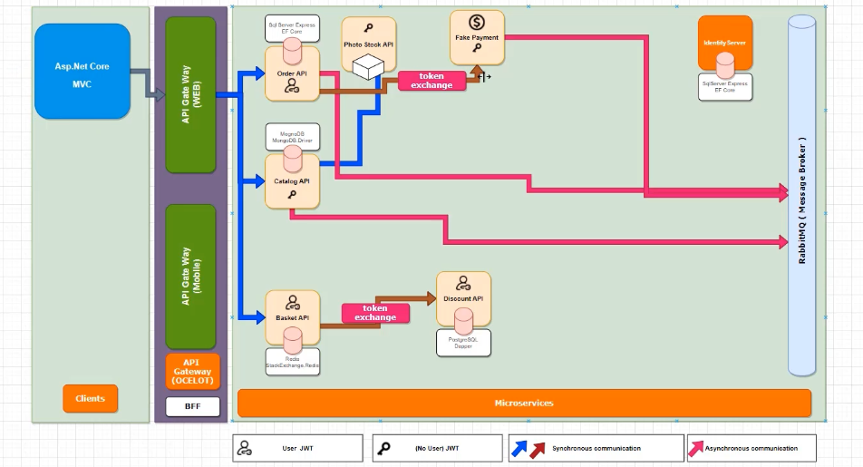

# Course Trading Application - AspNet Core Microservices Project

This project is a Course Trading Application built using AspNet Core technologies, featuring a microservices architecture. Here are the key highlights of the project:

- **Microservices Architecture:** The application is constructed using a microservices architecture, with an MVC client application communicating with microservices through a Gateway built using the Ocelot library. Microservices such as Order, Photo Stock, Payment, Catalog, Cart, and Discount are utilized.

- **Multiple Databases:** The project supports various databases including Postgresql, Redis, MSSQL, and MongoDB, and utilizes EF Core and Dapper ORM tools for efficient data management.

- **Message Communication:** Effective communication between microservices is facilitated using RabbitMQ (Mass-Transit) for message brokering.

- **Security:** To ensure microservices' security, a token exchange mechanism is employed. A centralized IdentityServer is used for authentication, while the MVC application employs cookie-based authentication.

- **Docker Support:** The project can be easily deployed and services can be brought up using Docker.

